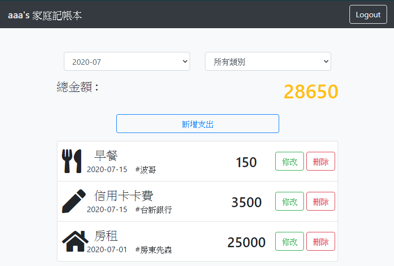

# 老爸的私房錢
簡單記帳功能

# 功能描述
- 可新增單筆花費
- 可修改單筆花費內容
- 可刪除單筆花費
- 可記錄總花費金額
- 可依類別篩選
- 可依月份篩選
  
# 預覽畫面

# 測試資料
Email: user@gmail.com
password: 0000

# 安裝與執行步驟
1. 下載專案
> git clone https://github.com/ShengYaoHuang/expense-tracker.git

2. 進入專案資料夾
> cd expense-tracker

3.下載套件
> npm install

4. 安裝種子資料
> npm run seed

5. 執行程式
> npm run dev

# 環境建置與需求
- bcryptjs: ^2.4.3
- body-parser: ^1.19.0
- connect-flash: ^0.1.1
- dotenv: ^8.2.0
- express: ^4.17.1
- express-handlebars: ^5.1.0
- express-session: ^1.17.1
- method-override: ^3.0.0
- mongoose: ^5.9.27
- passport: ^0.4.1
- passport-facebook: ^3.0.0
- passport-local: ^1.0.0